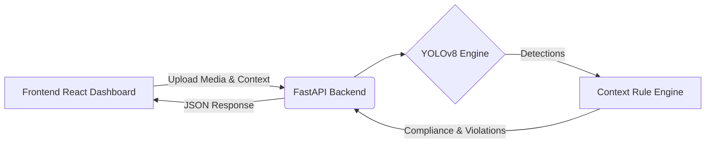

# DeepInspection AI 🦉


> **DeepInspection AI transforms object detection into structured compliance intelligence through hybrid perception and rule-based reasoning.**

## 🔷 System Description

DeepInspection AI is an AI-powered compliance inspection system designed to perform domain-specific visual evaluations using a hybrid intelligence architecture.

The system integrates a perception layer powered by YOLO object detection and a rule-based compliance engine to evaluate operational safety and protocol adherence across configurable domains such as classroom monitoring, construction safety, and other inspection contexts.

DeepInspection AI does not store uploaded media files. Instead, it generates structured inspection reports that include detected objects, violation counts, inspection status, and contextual rule evaluation. These reports are stored securely in MongoDB as persistent audit records.

The platform provides:

*   **Context-aware inspection logic**
*   **Person and object detection using YOLO**
*   **Domain-specific rule enforcement**
*   **Violation tracking and risk classification**
*   **Structured inspection reports**
*   **Persistent activity logs**
*   **Interactive inspection querying grounded in structured data**

The system separates perception (object detection) from cognition (rule evaluation and AI reasoning), ensuring explainability, modularity, and extensibility.

DeepInspection AI is designed as a research-style hybrid intelligent compliance system, prioritizing structured evaluation, auditability, and privacy-preserving inspection workflows.

---

## 🛡️ Clean Compliance Philosophy

> DeepInspection AI is designed as a domain-restricted compliance assistant. It performs structured visual inspection and rule evaluation without biometric identification or personal identity tracking.

---

## 🚀 Live Demo
**Try it out:** [https://deepinspection-ai.vercel.app](https://deepinspection-ai.vercel.app) *(Link to be updated after deployment)*

---

## 🎯 The Problem
Standard video monitoring requires constant human attention, is prone to error, and doesn't understand context. DeepInspection AI introduces **domain-aware intelligence**.

**Supported Contexts & Rules:**
*   **🏗️ Construction:** Hardhat & Safety Vest detection. 
*   **🏥 Hospital:** Surgical Mask & PPE compliance.
*   **🎓 Classroom:** Attention detection (mobile phone usage tracking).

---

## ✨ Dashboard Features & System Legitimacy

### Dashboard Features
*   **Compliance Status Overview** (Not inflated scoring)
*   **Total Inspections Count**
*   **Safety Violation Summary**
*   **Recent Activity Logs**
*   **Domain-based inspection tracking**
*   **Upload quick-access panel**
*   **Context rule visibility**
*   **Structured inspection result display**

### What Makes It Legit
*   ✔ Uses real YOLO detection
*   ✔ Uses rule-based compliance logic
*   ✔ Stores structured reports (not raw images)
*   ✔ Displays real violation counts
*   ✔ Does not fake AI scoring
*   ✔ Supports domain-based evaluation
*   ✔ Designed with modular AI architecture

---

## 🏗️ Architecture



- **Frontend:** React (Vite), React Router, Vanilla CSS (Custom Design System).
- **Backend:** Python, FastAPI, Ultralytics YOLOv8, OpenCV.
- **Inference:** YOLOv8n (optimized CPU deployment safe for free-tier hosting).

---

## 📸 Demo Screenshots

*(Add screenshots to `docs/demo_images/` before final submission)*

| Dashboard Overview | Media Upload Analysis |
|:---:|:---:|
|  |  |

---

## 💻 Running Locally

### 1. Clone the repository
```bash
git clone https://github.com/your-username/deepinspection-ai.git
cd deepinspection-ai
```

### 2. Start the Backend
```bash
cd backend
python -m venv venv
source venv/bin/activate  # On Windows: venv\Scripts\activate
pip install -r requirements.txt
uvicorn main:app --reload
```
*Backend runs on `http://127.0.0.1:8000`*

### 3. Start the Frontend
Open a new terminal:
```bash
cd frontend
npm install
npm run dev
```
*Frontend runs on `http://localhost:5173`*

---

## ☁️ Deployment Guide

### Backend (Render)
1. Push to GitHub.
2. Create New **Web Service** on Render.
3. Connect repo and set Root Directory to `backend/`.
4. Build Command: `pip install -r requirements.txt`
5. Start Command: `uvicorn main:app --host 0.0.0.0 --port 10000`
*Note: We utilize the lightweight `yolov8n.pt` model to ensure compatibility with Render's generous free tier.*

### Frontend (Vercel)
1. Connect GitHub repo to Vercel.
2. Set Framework Preset to **Vite**.
3. Set Root Directory to `frontend/`.
4. Deploy!

---

## 📄 API Documentation
When running locally, full interactive API documentation is automatically generated:
👉 `http://127.0.0.1:8000/docs`

### Example Endpoint Response (`/analyze-image`)
```json
{
  "total_persons": 4,
  "total_phones": 2,
  "violations": ["Phone detected in classroom", "Phone detected in classroom"],
  "compliance_rate": 50.0,
  "context": "Classroom Attention"
}
```
